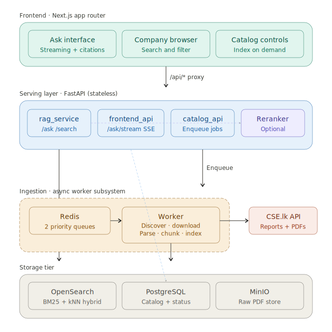
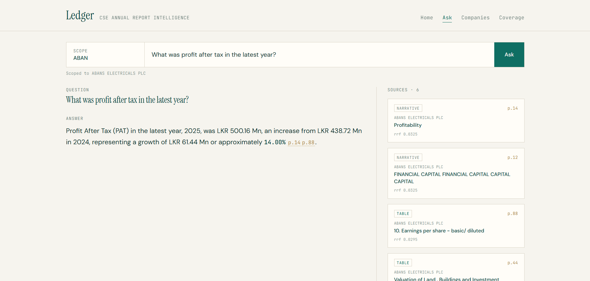
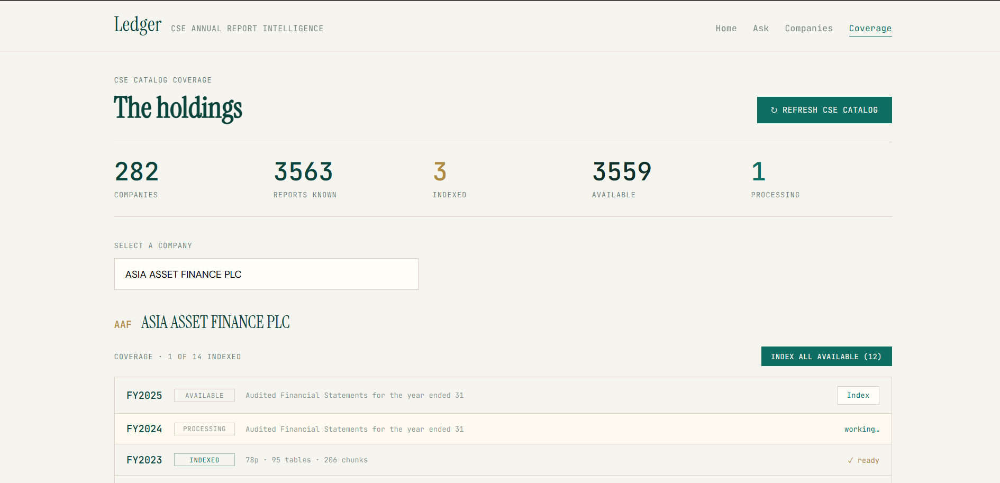
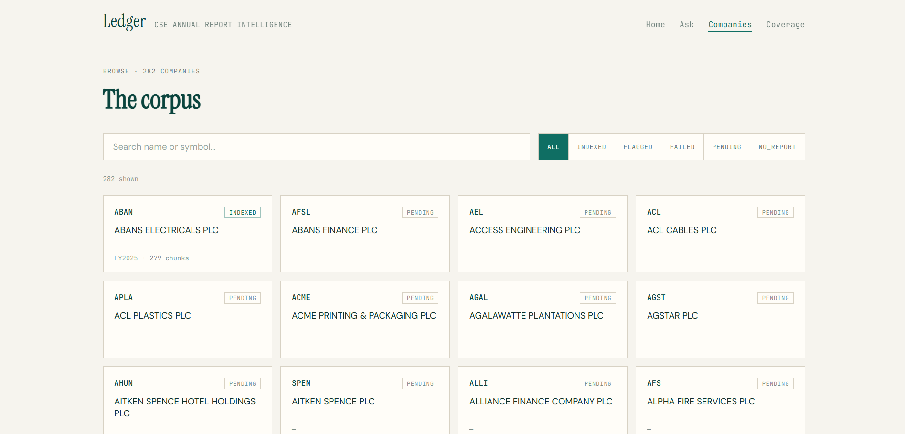

# CSE RAG Intelligence

A production-grade Retrieval-Augmented Generation system for analysing annual
reports from the **Colombo Stock Exchange (CSE)**. Ask financial questions in
plain language across listed companies and get answers grounded in the actual
reports — every figure traceable to its source page.





## User Interfaces








## What it does

- **Discovers** every annual report CSE publishes (full catalogue, all years)
- **Indexes on demand** — pick a company/report from the UI and it's parsed,
  chunked, embedded and made queryable
- **Answers questions** with hybrid retrieval (BM25 + vector) and optional
  cross-encoder reranking, streaming the answer with inline page citations
- **Shows its work** — every answer links to the exact report section and page

## Architecture at a glance

| Layer | Tech | Role |
|-------|------|------|
| Frontend | Next.js (App Router) | Ask UI, company browser, coverage grid |
| Serving | FastAPI | Hybrid retrieval, streaming answers, catalogue API |
| Reranker | FastAPI + cross-encoder | Optional precision boost (local or hosted) |
| Ingestion | Python worker + Redis | Async discover → download → parse → index |
| Retrieval store | OpenSearch | Hybrid BM25 + kNN index |
| State | PostgreSQL | Company master + per-report ingestion status |
| Object store | MinIO | Raw PDFs + parsed artifacts |

Key design decisions are documented per-service in each folder's `README.md`.

## Quick start

```bash
git clone https://github.com/<you>/cse-rag-intelligence.git
cd cse-rag-intelligence

cp .env.example .env          # fill in OPENAI_API_KEY (rotate any shared key!)

cp ./frontend/.env.local.example ./frontend/.env.local      # BACKEND_URL=http://rag-api:8000

cp ./data/CompanyList.example.csv ./data/CompanyList.csv    # Populate the CSV with your Own Data

# bring up the core stack
docker compose up -d --build

# load companies + discover the catalogue
docker compose exec worker python load_companies.py /app/data/CompanyList.csv
curl -X POST localhost:8000/catalog/refresh -H "Content-Type: application/json" -d '{"limit": 10}'

# open the UI
open http://localhost:3000
```

To run **with reranking**:
```bash
docker compose --profile rerank up -d --build
# set RERANK_ENABLED=true in .env
```

## How indexing works

```
Discover  →  Postgres marks reports AVAILABLE  (cheap, metadata only)
Click "Index" in UI  →  API enqueues job on Redis  →  returns instantly
Worker  →  download → Docling parse → quality gate → chunk → LLM table
           summaries → embed → OpenSearch.  Status flips live in the UI:
           AVAILABLE → QUEUED → PROCESSING → INDEXED
```

Indexing is **decoupled** from the API via a Redis queue and a separate worker,
so heavy PDF parsing never blocks query serving. Two priority queues ensure
on-demand indexing never waits behind a full catalogue refresh.

## Retrieval pipeline

```
question → hybrid retrieve (BM25 + kNN, wide) → RRF fusion
        → cross-encoder rerank (optional) → inject raw tables
        → LLM generation → grounded answer + page citations
```

The **table summary + raw retrieval** pattern is central: each financial table
is summarised by an LLM (the summary is embedded for retrieval), while the raw
table markdown is stored and injected into context at answer time — so answers
come from the actual figures, not a paraphrase.

## Repository layout

```
backend/      FastAPI serving layer (rag_service, frontend_api, catalog_api)
ingestion/    Async worker, CSE client, discovery, pipeline, Postgres schema
reranker/     Standalone multi-backend reranker service
frontend/     Next.js App Router app
evaluation/   Eval set + harness (recall@k, MRR, faithfulness, refusal)
scripts/      Standalone pipeline scripts (parsing/chunking experiments)
docs/         Architecture diagram
```

## Status & roadmap

Built and working: full ingestion + retrieval + serving + frontend, containerised.

Planned: measured eval results (reranking lift), security hardening
(OpenSearch auth, API auth), and an Airflow migration for scheduled catalogue
refresh and orchestrated ingestion.

## Notes

This is a portfolio / learning project. It uses the public CSE financials
endpoint; respect their terms of use and rate limits. Not affiliated with the
Colombo Stock Exchange.

## License

MIT — see [LICENSE](LICENSE).
